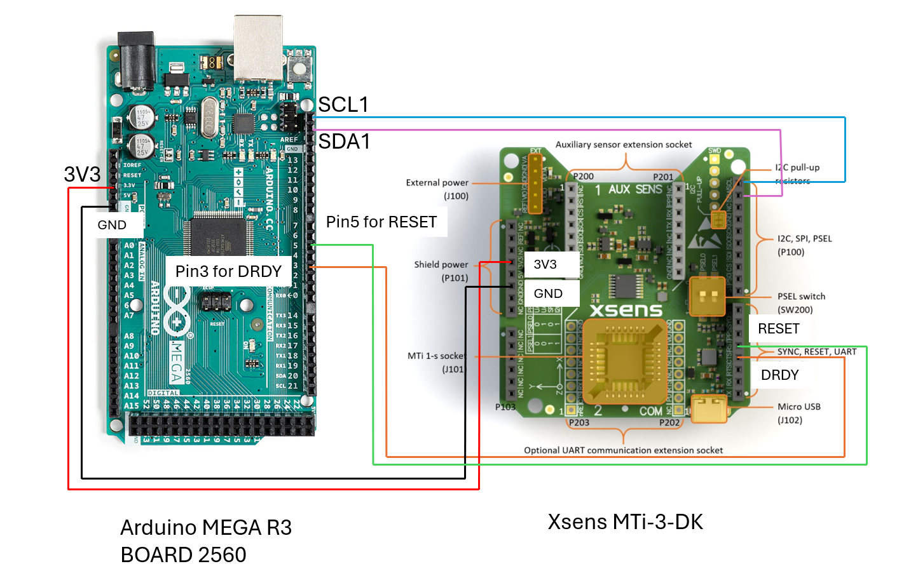

# Xsens MTi-3-DK Interface with Arduino MEGA

## Introduction

This example code is tested between the [Arduino MEGA R3 Board 2560](https://docs.arduino.cc/hardware/mega-2560/) and the Xsens MTi-3-DK(Hardware version 3).

##Interface

| Arduino Mega  | MTi-3-DK     |
| ------------- | ------------ |
| 3V3 Power     | 3V3(P101-4)  |
| GND           | GND(P101-6)  |
| SCL1          | DRDY(P102-4) |
| SDA1          | SDA(P100-9)  |
| Digital Pin 3 | SCL(P100-10) |

or see this image:



## Change the Bytes Limit of Arduino Library

The default Arduino library has limit on 32 bytes, that means you couln't get three types of data including acc, rateofturn, mag, which would be 48 bytes.

You could change the values in the Arduino library, by default it is at:
```
C:\Users\{YOUR_USER_NAME}\AppData\Local\Arduino15\packages\arduino\hardware\avr\1.8.6\libraries\Wire\src
```
Now you could change the `Wire.h`'s value to:
```
#define BUFFER_LENGTH 64
```
And the `utility\twi.h`'s value to:
```
  #define TWI_BUFFER_LENGTH 64
```
In this case, you could get data up to 64 bytes, and this could cover 4 types of float32 data(euler, acc, rateofturn, mag).

## Change the Output Configuration
If you want to change the output, you could change the `output_config_payload` in the [mt_application.cpp](mt_application.cpp):
```
uint8_t data_rate = 1; //change this value to desired data
uint8_t output_config_payload[] = { 0x20, 0x30, 0x00, data_rate, 0x40, 0x20, 0x00, data_rate, 0x80, 0x20, 0x00, data_rate, 0xC0, 0x20, 0x00, data_rate };
```
For more information, please refer to:
- [How to use Device Data View to learn MT Low Level Communications](https://base.movella.com/s/article/article/How-to-use-Device-Data-View-to-learn-MT-Low-Level-Communications)
- [MT Low Level Communication Protocol Documentation](https://mtidocs.movella.com/mt-low-level-communication-protocol-documentation)

Please note that the allowed output bytes should be less equal than 64 bytes.

## Change the address of the MTi
You could refer to the [MTi-1 Series Datasheet](https://mtidocs.movella.com/functional-description$i2c), for example, if you want to change the address to `0x6A`, you could connect the Arduino's GND to the MTi-3-DK's pin 100-6(ADD0).

## Note for Arduino UNO
I tested this in Arduino UNO, but the dynamic memory of UNO is so low, it is almost not possible to run.